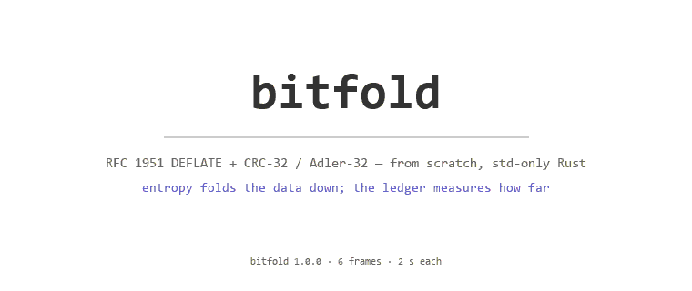
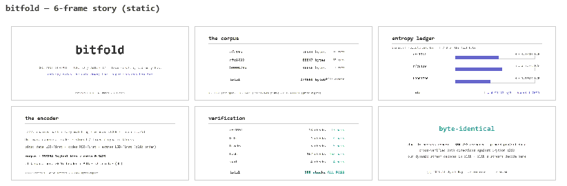

# Bitfold

[](https://www.rust-lang.org/)
[](https://doc.rust-lang.org/std/)
[](https://www.rfc-editor.org/rfc/rfc1951)
[](https://www.rust-lang.org/tools/install)
[](LICENSE)

[](https://zlib.net)

**RFC 1951 DEFLATE and the zlib container — an LZ77 matcher, canonical Huffman
encoder, and round-trip decoder built from scratch in Rust (`std` only),
cross-verified both directions against CPython's zlib, with a 188-check
key-attestation battery and a fixed-point entropy ledger.**

Bitfold compresses with a chained-hash LZ77 stage (window 32 768, matches
3–258, lazy evaluation) feeding a canonical Huffman stage over stored, fixed,
and dynamic blocks; it unpacks the result with its own independent bit-level
decoder. Around the core: CRC-32 and Adler-32 verified against the full 162-vector
zlib hash-test table, the `78 9c` + Adler-32 container, a u128 fixed-point
(2⁴⁰-scale) entropy ledger, and a public-domain 274 689-byte corpus
([RFC 1951](https://www.rfc-editor.org/rfc/rfc1951),
[RFC 8439](https://www.rfc-editor.org/rfc/rfc8439),
[OEIS A000796](https://oeis.org/A000796) prime digits) that every round trip
is checked against byte for byte.

No crates. No `libm` beyond what `std` gives. No wall clock anywhere: every
artifact this repo can produce is a pure function of the embedded corpus and
the pinned KAT vectors, and re-running anything — the battery, the PDF
dossier, the SVG animation — produces byte-identical output. That claim is not
a slogan; it is attested in `assets/attestation.txt` by a dual-run SHA-256
diff, and re-attestable with `cargo run --release -- attest`.

---

## What is in the box

| Module | What it is |
| --- | --- |
| `lzw77` | The LZ77 stage: chained hash (2¹⁶ buckets, chain limit 128) + lazy matching, emitting `Literal` / `Match{len, dist}` phrases with one-byte-at-a-time overlap semantics |
| `huff` | Canonical Huffman code assignment (Kraft-checked), the fixed literal/length and distance tables, the length/distance code pickers with base+extra decomposition, the 16/17/18 code-length run coder, and a `(len, code) → symbol` decode table |
| `deflate` | The encoder: per-block stored/fixed/dynamic planning (bit-cost model), the RFC §3.2.7 code-length header with the correct `HCLEN` semantics, and the `zlib` container wrapper (`78 9c` + Adler-32 trailer) |
| `inflate` | The decoder: bit-level state machine for stored/fixed/dynamic blocks, the code-length table construction, and the container checks (checksum, CMF, FDICT) — with `InflateError` covering `BadFormat` / `Truncated` / `ChecksumMismatch` / `Overfull` |
| `bits` | The bit packer with the two element orders made explicit: `push_lsb`/`next_lsb` for header fields and extra bits, `push_huff`/`next_huff` for the codes themselves |
| `adler` / `crc32` | Adler-32 (with the `NMAX` 5552-chunk reduction) and CRC-32 (reflected IEEE, table-driven) — both with initial-state entry points for streaming |
| `entropy` | The u128 fixed-point ledger: Shannon H per corpus part and total, the memoryless ratio bound, top-symbol profiles, and the wasted-bits / efficiency relations |
| `kats` + `kat_data` | The 188-check KAT battery (RFC pins, bit-order pins, block pins, the 162-vector zlib hash table, cross-verification pins) and its CPython-verified data |
| `corpus` | The three embedded public-domain parts, 274 689 bytes total |
| `battery` / `pdf` | The verification report and the hand-rolled deterministic PDF 1.4 writer (base-14 fonts, fixed `/ID`, fixed creation dates) that typesets it |
| `svg` | The 6-frame SMIL story (discrete animation, no JS) and its static contact sheet; `tools/make_gif.py` renders the same six frames to `assets/anim.gif` / `assets/sheet.gif` (deterministic Pillow) |
| `crypto` | A zero-dependency SHA-256 (FIPS 180-4) used only for the attestation digests |
| `attest` | The dual-run byte-identity attestation |

Every number below is reproducible from the committed artifacts or from
`cargo test` / the CLI.

---

## The conformance findings: two places the RFC lies to you

Both DEFLATE implementations in the wild (zlib's `inflate` and Mark Adler's
`puff.c`) implement the format as *actually used*, and in two places the
de facto wire format disagrees with the RFC 1951 prose. A self-consistent
encoder can pass every internal round trip and still be unusable — which is
exactly how both bugs were found: our streams decoded fine in our own decoder
until CPython's `zlib.decompress` rejected them.

**1. `HCLEN` is a prefix count, not a nonzero count (§3.2.7).** The RFC says
`HCLEN` is "the number of code-length codes minus three." zlib reads exactly
`HCLEN + 4` entries from `CODE_LENGTH_ORDER` and zeroes the rest
(`inftrees.c`). A self-consistent encoder that writes all 19 code lengths and
sets `HCLEN` to the *nonzero* count is rejected with "invalid code lengths
set." The fix is to define `K` as one past the last nonzero length's position
in `CODE_LENGTH_ORDER` (minimum 4), write exactly `K` lengths, and set
`HCLEN = K − 4`. The battery pins this with the RFC's own run example:
twelve 8s encode to symbols `[8, 16, 16]` with stored repeat counts `[0, 3, 2]`
(expanding to `1 + 6 + 5 = 12`).

**2. The §3.2.5 extra bits are LSB-first on the wire.** The prose says the
extra bits are read "most-significant-bit first (bits `1110` = 14)"; the
reference implementations read them with `hold & mask`, i.e. **least-
significant bit first** — the first stream bit is the value's LSB. Only the
Huffman *codes* are MSB-first. After fixing this, `zlib.decompress` decoded
our dynamic stream to the exact original 2 250 bytes, and zlib's own
fixed-block streams (levels 1 and 6, plus 3 000 incompressible bytes) decoded
byte-identically through our decoder. Both directions are pinned as KATs.

With those two contracts honoured, the full bit-order picture is:

- stream packing is LSB-first within a byte (§3.1.1) — every *field* (block
  header, `LEN`/`NLEN`, `HLIT`/`HDIST`/`HCLEN`, 3-bit code lengths, 16/17/18
  repeat counts, and the §3.2.5 extra bits) goes through `push_lsb`;
- Huffman *codes* are transmitted MSB-of-code first — through `push_huff`,
  which appears bit-reversed inside each output byte (code `0xDE` → byte
  `0x7B`);
- the battery pins both orders on the same 3+4+1-bit sequence:
  LSB-first gives byte `0xD6`, MSB-first gives `0xAB`.

---

## The entropy ledger, and what "beating the bound" means

The ledger computes Shannon H over the byte histogram of each corpus part in
u128 fixed point at 2⁴⁰ scale (the only float in the pipeline is the
per-symbol `−p log₂ p`); the total:

```
rfc1951       36944 B   H = 4.33486 b/B   bound 1.8455   top: 0x20 ×11662
rfc8439       88847 B   H = 4.72736 b/B   bound 1.6923   top: 0x20 ×24651
b0000796     148898 B   H = 3.50329 b/B   bound 2.2836   top: 0x0a ×20004
total        274689 B   H = 4.53187 b/B   bound 1.7653
```

The byte-histogram entropy is the bound for a **memoryless** encoder — one
code per byte. DEFLATE encodes LZ77 *phrases*, so the LZ77 stage may lawfully
beat that bound by exploiting sequential redundancy that per-byte entropy
cannot see. On the corpus it does, and the report says so instead of
hand-waving:

```
achieved ratio : 0.3428 (94156 B / 274689 B)
entropy fold   : 491662 bits BELOW the memoryless bound
                 (1.7899 bits/byte under H = 4.53187) — the LZ77 stage
                 captured the sequential redundancy that per-byte
                 entropy cannot see; beating that bound is the win.
efficiency     : 165.28% of the memoryless bound (>100% = below it)
```

491 662 bits is exactly the difference between the 1 244 856-bit bound and the
753 194 logical bits on the wire — verified independently in Python.

---

## Verification

Three layers, all reproducible:

1. **`cargo test` — 77 tests.** Bit-order round trips and exhaustion
   semantics; canonical Huffman against the RFC §3.2.2 example, the fixed
   table profiles, and exhaustive length/distance picker round trips
   (every `len ∈ 3..=258`, every `dist ∈ 1..=32 768`); the 16/17/18 run
   coding including the 200-zero case and the leading-16 rejection; encoder/
   decoder round trips at the block boundaries (65 534 / 65 535 / 65 536 /
   131 087), the full-window distance 32 768, overlap copies, multi-block
   streams; container rejections (checksum, FDICT, truncation); Adler-32 and
   CRC-32 known vectors, `NMAX` chunking, and the 162 zlib hash vectors
   re-checked end-to-end; entropy known values (constant = 0, two equal
   symbols = 1 bit, uniform-256 = 8) and the fixed-point relations; and the
   artifact determinism/structure suite (dual-render byte identity, PDF
   magic and pages, the 6-frame SMIL structure, the static contact sheet).
2. **The 188-check KAT battery** (`cargo run --release -- kats`):
   13 RFC pins + 4 bit-order pins + 5 block pins + 162 zlib hash vectors +
   4 cross-verification pins:

   ```
   xval-our-dynamic-fox       our 70-byte dynamic stream, pinned hex,
                              CPython zlib.decompress-verified byte-identical
   xval-cpython-fixed-fox-1   zlib level 1 (fixed blocks), 77 B → 2250 B
   xval-cpython-fixed-fox-6   zlib level 6 (fixed blocks), 72 B → 2250 B
   xval-cpython-fixed-data    zlib level 1 on 3000 incompressible B, 309 B
   ```
3. **`assets/attestation.txt`** — the report and the dossier (the report
   typeset by the hand-rolled PDF writer — two pages, base-14 fonts, fixed
   `/ID` and creation dates, regenerable via `cargo run -- dossier`, not
   committed) are each generated **twice** in-process and SHA-256-compared:

   ```
   render 1 (in-process):
     report.txt         3119 B  b38bde143d2c5a8bd6ce54b4aaccb850204d9f6311002f8d58b9296d459b1043
     dossier.pdf        6548 B  e5d9030f1d27c2c21737e9f69eaf1d9c774e76e60363f477d8bc4be2819434f0

   render 2 (in-process):
     report.txt         3119 B  b38bde143d2c5a8bd6ce54b4aaccb850204d9f6311002f8d58b9296d459b1043
     dossier.pdf        6548 B  e5d9030f1d27c2c21737e9f69eaf1d9c774e76e60363f477d8bc4be2819434f0

   verdict : BYTE-IDENTICAL — both renders reproduce the same digests.
   ```

   (Three consecutive cross-process runs — not just the dual in-process
   render — reproduce every hash above, and the regenerable dossier,
   exactly.)

The six-frame story: the corpus, the ledger, the encoder, the verification,
and the verdict — animated (2 s per frame, 12 s cycle, loops forever):

<p align="center">
  
</p>

<p align="center">
  
</p>

*The SMIL source is `assets/anim.svg` / `assets/frames.svg` (opens in any
browser); the GIFs are rendered by `python tools/make_gif.py` from the same
pinned numbers — no wall clock, no randomness, stable bytes.*

---

## Building and running

Rust 1.94+ (any recent stable), no dependencies:

```
cargo test                            # 77 tests
cargo run --release -- version        # bitfold 1.0.0
cargo run --release -- demo           # corpus round trip + ledger summary
cargo run --release -- kats           # 188-check battery summary
cargo run --release -- battery        # -> assets/report.txt
cargo run --release -- dossier        # -> assets/dossier.pdf (regenerable, not committed)
cargo run --release -- attest         # -> assets/attestation.txt (exit 1 on mismatch)
cargo run --release -- svg            # -> assets/anim.svg + assets/frames.svg
python tools/make_gif.py              # -> assets/anim.gif + assets/sheet.gif
```

Every artifact command prints the SHA-256 of what it wrote, so a re-run is
self-verifying.

## References

- P. Deutsch, [*"DEFLATE Compressed Data Format Specification version 1.1"*, RFC 1951](https://www.rfc-editor.org/rfc/rfc1951), May 1996; P. Deutsch, [*"ZLIB Compressed Data Format Specification version 3.3"*, RFC 1950](https://www.rfc-editor.org/rfc/rfc1950).
- M. Adler, *"A Fast Algorithm for File Compression"*, Byte magazine 9(11),
  Nov 1984 (Adler-32; the `NMAX = 5552` chunking as implemented in
  [`adler32.c`](https://github.com/madler/zlib/blob/master/adler32.c)); CRC-32
  (IEEE 802.3, reflected polynomial `0xEDB88320`); the 162-vector hash test
  table (`long_string` and friends — extracted verbatim, every vector
  CPython-verified at generation time by `tools/gen_kat_data.py`);
  [`puff.c`](https://github.com/madler/zlib/blob/master/contrib/puff/puff.c)
  (the `bits()` LSB-first extra-bit reader) and
  [`inftrees.c`](https://github.com/madler/zlib/blob/master/inftrees.c)
  (the `HCLEN` prefix semantics).
- [C. Shannon, *"A Mathematical Theory of Communication"*, Bell System Technical Journal 27, 1948](https://ieeexplore.ieee.org/document/6773024) (the H and the memoryless bound).
- [NIST, *FIPS 180-4: Secure Hash Standard*](https://nvlpubs.nist.gov/nistpubs/FIPS/NIST.FIPS.180-4.pdf).
- Corpus sources: [RFC 1951 text](https://www.rfc-editor.org/rfc/rfc1951.txt), [RFC 8439 text](https://www.rfc-editor.org/rfc/rfc8439.txt), [OEIS A000796 — digits of prime constants](https://oeis.org/A000796).

---

<p align="center">© 2026 Adithya N Raj</p>
